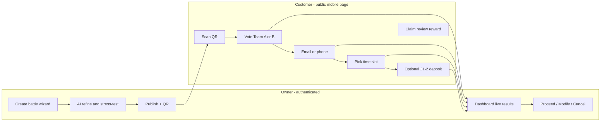

# MenuBattle — Hackathon Build Plan

## What we agreed on

| Decision              | Your answer                                                                                       |
| --------------------- | ------------------------------------------------------------------------------------------------- |
| Product               | **MenuBattle Live** — two competing options, not a generic survey                                 |
| Positioning           | Gamified: _"Turn menu ideas into paid experiments"_ / _"Test demand before you cook"_             |
| Name                  | **MenuBattle**                                                                                    |
| Target market (pitch) | All local businesses; **café-first** for today's demo                                             |
| Customer reach        | QR code at till → mobile page                                                                     |
| Auth                  | **Owner login only**; customers use public links (no account)                                     |
| Payments              | **Mollie** for real deposits, but deposit step is **optional**; mock/fallback if integration lags |
| Deposit model         | **£1–£2 credit** against final order                                                              |
| Commitment ladder     | Full: Vote → Register → Reserve → Deposit (optional)                                              |
| Customer questions    | **Minimal** (pick team, contact, time, optional pay)                                              |
| AI                    | Guide owner through setup + **stress-test feasibility** (ingredients, margin, sourcing)           |
| Database              | Extend existing **MongoDB** in [`lib/mongodb.ts`](lib/mongodb.ts)                                 |
| Break-even            | **Medium**: revenue − food cost % − staffing − wastage vs threshold                               |
| Dashboard output      | Progress bar + numbers + **Proceed / Modify / Cancel** verdict                                    |
| Business model pitch  | **Freemium** (first battle free) + **business waitlist** as validation evidence                   |
| Design                | Warm, local, café-friendly **with game energy**; review freebie + winner discount                 |
| Infra                 | Extend starter ([`lib/auth.ts`](lib/auth.ts), OpenRouter); already on **Vercel**                  |

## Locked decisions (chosen for you)

These were left open in the Q&A — here are the concrete calls for today's build:

### Demo experiment (pre-seed on Vercel)

**Battle:** _"Should we open afternoons with sweet treats or savoury plates?"_

|            | Team Sweet          | Team Savoury                |
| ---------- | ------------------- | --------------------------- |
| Offer      | Coffee + cake slice | Half sandwich, soup & drink |
| Price      | £6.00               | £8.00                       |
| Window     | Thu 3–5 PM          | Thu 3–5 PM                  |
| Team color | Rose/cream          | Sage green                  |

**Owner inputs for seed data:** max 20 portions, min 12 bookings to run, £45 additional staffing cost, 30% food cost, £8 wastage allowance, deadline Wednesday 8 PM.

**Why this one:** fits all-day breakfast café, tests underused afternoon hours, matches [`my_docs/menu.md`](my_docs/menu.md), easy for QR outreach ("which afternoon menu should they serve?").

If the real café partner confirms later, duplicate this battle with their name — same structure, swap copy.

### Battle mechanics

- **Format:** always two options (A vs B). No single-experiment mode for hackathon.
- **Winner:** Battle Score (see weights below). **Gate:** winning team must also hit `minBookings` or battle status = `failed` (neither runs).
- **Close:** owner manually taps "Close battle" on dashboard (no auto-close cron today).
- **Loser backers:** message on result page — _"Your team didn't win. Your £1 deposit becomes café credit. Try next week's battle."_
- **Winner backers:** _"Team Sweet wins! Show this page Thursday 3–5 PM. Your £1 is credited off your order."_

### Payments (resolved ambiguity)

- **Build:** Mollie create + webhook in P1, not blocking P0.
- **P0:** deposit step shows "Pay £1 (credited off your order)" with a **demo checkout** that marks response as deposited — works without Mollie keys.
- **P1:** swap demo button for real Mollie redirect when `MOLLIE_API_KEY` is set.
- **Amount:** fixed **£1** for hackathon (not owner-configurable today).
- **Optional:** customers can stop after reserve; deposit unlocks winner discount perk.

### Incentive ladder

| Step                            | Customer gets                                                                              |
| ------------------------------- | ------------------------------------------------------------------------------------------ |
| Vote only                       | Entry to battle; nudge to continue                                                         |
| Register (email or phone)       | Joins café panel; counted in break-even                                                    |
| Reserve time slot               | Spot held; shown on owner dashboard                                                        |
| Pay £1 deposit                  | £1 off if their team wins                                                                  |
| Leave Google review (post-vote) | Honor-system reward code `REVIEW-SIDE` → free side dish; owner marks redeemed in dashboard |

Google review link stored on `businesses.googleReviewUrl` — owner pastes URL in setup wizard.

### Owner onboarding flow

**3-step wizard** (not free-form chat):

1. **Business** — name, Google review URL (optional)
2. **Constraints** — ingredients (textarea), max portions, available hours, target margin %, min bookings, additional costs
3. **Battle** — AI generates two options from constraints → owner edits names/prices/descriptions → inline warnings shown → publish

AI stress-test = **post-form review** returning warnings array; owner must scroll past warnings to publish (no chat back-and-forth).

### URLs & multi-tenancy

- Public battle: `/b/[shortCode]` (6-char alphanumeric, e.g. `/b/xK9m2p`)
- Owner flow: sign up → first login prompts business profile → dashboard → create battle
- No marketplace browse page; each battle is private via link/QR only

### Live experience & gamification (in scope)

**P0 game elements:**

- Team names + colors
- Live supporter counts + £ committed
- Countdown to deadline
- Sticky score bar (polling every 5s)

**P1 game elements:**

- Unlock threshold: _"4 more backers to unlock free cardamom cream"_
- Referral link: skip for hackathon

**Out of scope:** badges, streaks, leaderboards across battles.

### Data & privacy

- Register tier: **email OR phone** (one required, customer picks)
- Consent checkbox: _"Contact me about this experiment"_
- No full privacy policy page today; one-line footer link placeholder

### Pitch structure (3–5 min)

1. **Problem** (45s) — local businesses launch experiments blind; surveys lie; failed launches cost staff + stock
2. **Solution** (30s) — MenuBattle: two realistic offers, escalating commitment, break-even math
3. **Live demo** (90s) — scan QR → vote → reserve → dashboard updates → verdict
4. **Traction** (45s) — business waitlist count + any real customer responses
5. **Business model** (30s) — freemium; first battle free, £19/battle after
6. **Ask** (15s) — judges + venue businesses join waitlist

### If café partner is a no-show

Run the same QR test **inside the hackathon venue** — ask 10–20 builders "which afternoon menu would you actually buy?" Still valid evidence; mention café conversation as discovery, venue as live test.

---

## The one loop to ship



---

## Architecture on top of existing starter

**Keep:**

- App Router, Tailwind 4, shadcn-style UI in [`components/ui/`](components/ui/)
- Owner auth: [`lib/auth.ts`](lib/auth.ts) + [`app/api/auth/*`](app/api/auth/)
- OpenRouter: refactor [`components/chat-panel.tsx`](components/chat-panel.tsx) into battle-setup assistant

**Add:**

### MongoDB collections

```
businesses     { ownerId, name, slug, googleReviewUrl?, createdAt }
battles        { businessId, slug, shortCode, status, question, deadline,
                 serviceDate, serviceWindow, maxCapacity, minBookings,
                 additionalCosts, foodCostPct, staffingCost, wastagePct,
                 options: [{ id, name, description, price, teamColor }],
                 battleScoreWeights, createdAt }
responses      { battleId, optionId, commitmentLevel, email?, phone?,
                 preferredTime?, depositAmount?, molliePaymentId?, reviewClaimed?,
                 createdAt }
waitlist       { email, businessType, name?, source, createdAt }
```

Indexes: `battles.shortCode` (unique), `responses.battleId`, `businesses.slug`.

### Routes

| Route                            | Purpose                                                    |
| -------------------------------- | ---------------------------------------------------------- |
| `/`                              | Landing: problem, demo, **business waitlist** form         |
| `/login`                         | Owner auth (existing)                                      |
| `/dashboard`                     | Owner home: battles list, create button                    |
| `/dashboard/battles/new`         | Guided wizard + AI stress-test                             |
| `/dashboard/battles/[id]`        | Live results, QR download, break-even, verdict             |
| `/b/[shortCode]`                 | **Mobile-first** public battle page                        |
| `/b/[shortCode]/result`          | Winner announcement (post-close)                           |
| `POST /api/battles`              | CRUD battles                                               |
| `POST /api/battles/[id]/respond` | Customer commitment steps                                  |
| `POST /api/battles/[id]/close`   | Owner closes + computes winner                             |
| `POST /api/ai/battle-setup`      | OpenRouter: generate/refine options + feasibility warnings |
| `POST /api/waitlist`             | Business waitlist capture                                  |
| `POST /api/payments/mollie/*`    | Create payment + webhook (optional tier)                   |

### New lib modules

- [`lib/battles.ts`](lib/battles.ts) — CRUD, scoring, break-even math
- [`lib/battle-score.ts`](lib/battle-score.ts) — weighted score per option
- [`lib/mollie.ts`](lib/mollie.ts) — payment create + webhook verify
- [`lib/ai-battle.ts`](lib/ai-battle.ts) — structured OpenRouter prompts for concept generation + stress-test

---

## Feature breakdown by priority

### P0 — Must ship for credible 7 PM demo

1. **Owner battle wizard** (3 steps) — business profile, constraints, AI-generated battle options
2. **AI assist step** — generate two options + inline feasibility warnings before publish
3. **Public battle page** (`/b/[code]`) — mobile-first, team cards, live supporter counts, countdown
4. **Commitment ladder** — vote → register (email or phone) → reserve (time slot) → optional £1 deposit (**demo checkout**, no Mollie required)
5. **Owner dashboard** — interest / reservations / deposits per team, break-even bar, **Proceed / Modify / Cancel**
6. **QR code** — generate link + QR for `/b/[shortCode]`
7. **Landing + business waitlist** — primary validation evidence
8. **Rebrand** APX → MenuBattle
9. **Pre-seeded demo battle** — Team Sweet vs Team Savoury (see Locked decisions)

### P1 — Strong differentiators (build if P0 loop works end-to-end)

10. **Real Mollie deposit** — swap demo checkout when API key present
11. **Battle Score breakdown** — show weighted score per team, not just raw counts
12. **Incentive UX** — Google review reward code + winner discount messaging
13. **Close battle flow** — owner closes, winner/loser result page, café credit copy
14. **Unlock threshold** — "X more backers to unlock bonus item"

### P2 — Pitch polish (time permitting)

13. Referral link per customer ("bring 2 friends")
14. Unlock threshold ("4 more backers to unlock bonus item")
15. Export customer list (CSV)
16. Email notification on battle close

**Explicitly defer:** CRM, multi-restaurant marketplace, POS/inventory, loyalty streaks, recurring weekly automation, native app.

---

## Break-even & Battle Score logic

**Break-even (medium complexity):**

```
expectedRevenue = deposits×price + reservations×price×conversionRate
foodCost = expectedRevenue × foodCostPct
totalCost = foodCost + staffingCost + additionalCosts + wastageAllowance
profit = expectedRevenue - totalCost
bookingsNeeded = ceil((fixedCosts) / (price × (1 - foodCostPct) - variablePerHead))
```

Show: `"Need 28 bookings to break even. Team Sweet: 19 interest, 11 reserved, 6 deposited."`

**Verdict rules:**

- **Proceed** — leading team hits min bookings + break-even threshold on deposits+reservations
- **Modify** — interest high but deposits low, or one team dominates on votes but not revenue
- **Cancel** — neither team near threshold by deadline

**Battle Score (per option):**

| Signal                      | Weight |
| --------------------------- | ------ |
| Paid deposits               | 40%    |
| Reservations                | 25%    |
| Votes                       | 15%    |
| Expected gross profit       | 15%    |
| Prep/waste risk (owner-set) | 5%     |

---

## Customer page UX (mobile-first, game feel)

- Header: café name + "This week's MenuBattle"
- Two **team cards** with color, dish name, price, supporter count, amount committed
- Tap team → stepped flow (progress dots: Vote → Contact → Time → Pay)
- Sticky bottom: current team score bar updating
- Post-vote modal:
  - "Your team needs you! Reserve a time to lock your spot"
  - "Pay £1 now → £1 off if Team Sweet wins"
  - "Leave us a Google review → free side" (link out + claim code)
- Warm palette (cream, espresso brown, accent green for winning team) — not childish neon

---

## Owner dashboard UX

Replace [`app/dashboard/page.tsx`](app/dashboard/page.tsx) starter content with:

1. **Battles list** — status badges (draft / live / closed)
2. **Battle detail** — split view:
   - Left: QR + share link + close battle button
   - Right: live metrics per team
3. **Break-even card** — progress ring, cost breakdown editable
4. **Verdict card** — large Proceed / Modify / Cancel with one-line rationale
5. **AI insights panel** — reuse OpenRouter: "Customers prefer 4:30 PM; Sweet leads on deposits not votes"

---

## Mollie integration plan

Env vars: `MOLLIE_API_KEY`, `MOLLIE_WEBHOOK_SECRET` (or URL verification).

Flow:

1. Customer taps "Pay £1 deposit" → `POST /api/payments/mollie/create` → redirect to Mollie checkout
2. Webhook `POST /api/payments/mollie/webhook` → update `responses.depositAmount` + `molliePaymentId`
3. **Fallback:** if Mollie not configured, show "Demo mode — mark as deposited" (clearly labeled for judges)

Hackathon sponsor integration is a judging plus — even 1–2 real deposits from strangers is strong evidence.

---

## AI battle-setup prompts

Replace generic chat with structured JSON output:

**Input:** owner constraints (ingredients, staff, hours, margin target, max portions)

**Output:**

```json
{
  "question": "Is afternoon traffic weak because of sweet or savoury demand?",
  "options": [
    { "name": "Team Sweet", "description": "...", "price": 6.5, "risk": "low" },
    {
      "name": "Team Savoury",
      "description": "...",
      "price": 8.5,
      "risk": "medium"
    }
  ],
  "warnings": [
    "Savoury margin is 22% — below your 30% target",
    "Chicken not in ingredient list"
  ]
}
```

Owner edits, acknowledges warnings, publishes.

---

## Pitch & validation strategy

**Opening:** café uncertainty story (even if qualitative — "owner doesn't know what afternoon offer to run")

**Live demo beats:**

1. Show pre-seeded battle QR on screen
2. Audience scans → picks team → reserves
3. Dashboard updates counts + break-even
4. Show business waitlist count ("12 other owners signed up today")
5. AI generating battle from constraints (30-second moment)

**Validation targets:**

- Primary: **business waitlist signups** (other cafés, pubs, salons at venue)
- Secondary: 10–20 customer responses via QR at partner café or venue outreach
- Stretch: 1–2 real Mollie deposits from strangers

**Freemium pitch:** first battle free; £19/battle or £49/month for recurring battles (from [`my_docs/menu.md`](my_docs/menu.md) — mention in deck, don't build billing today).

---

## Suggested build order (parallelizable)

```mermaid
gantt
  title Hackathon build sequence
  dateFormat HH:mm
  axisFormat %H:%M

  section Foundation
  DataModel_and_API     :a1, 10:30, 90m
  BattleWizard_owner    :a2, after a1, 90m

  section Customer
  PublicBattlePage      :b1, after a1, 120m
  CommitmentLadder      :b2, after b1, 60m

  section Intelligence
  BreakEven_Score       :c1, after a2, 60m
  AI_setup              :c2, after a1, 90m

  section GoToMarket
  Landing_Waitlist      :d1, 11:00, 60m
  Mollie_optional       :d2, after b2, 90m
  QR_polish_pitch       :d3, after c1, 60m
```



**Commercial track (parallel):** café visit to lock experiment + QR placement; collect 3–5 business waitlist signups from other teams at venue; document failed-experiment quote for pitch.

---

## Key files to create/modify

| Action | File                                                                         |
| ------ | ---------------------------------------------------------------------------- |
| Modify | [`app/page.tsx`](app/page.tsx) — MenuBattle landing + waitlist               |
| Modify | [`app/dashboard/page.tsx`](app/dashboard/page.tsx) — battles overview        |
| Create | `app/dashboard/battles/new/page.tsx`                                         |
| Create | `app/dashboard/battles/[id]/page.tsx`                                        |
| Create | `app/b/[shortCode]/page.tsx`                                                 |
| Create | `lib/battles.ts`, `lib/battle-score.ts`, `lib/ai-battle.ts`, `lib/mollie.ts` |
| Create | `app/api/battles/route.ts` + nested routes                                   |
| Create | `app/api/waitlist/route.ts`                                                  |
| Create | `components/battle/` — team cards, commitment stepper, score bar, QR display |
| Modify | [`app/layout.tsx`](app/layout.tsx) — metadata, branding                      |

---

## Risks and mitigations

| Risk                           | Mitigation                                                           |
| ------------------------------ | -------------------------------------------------------------------- |
| Scope too large ("everything") | Ship P0 first; P1 only after live battle loop works end-to-end       |
| Café partner unclear           | Pre-seed demo battle; run QR at hackathon venue if needed            |
| Mollie integration slow        | Optional deposit + demo fallback; reservations still prove demand    |
| No customer responses          | Team members + nearby builders scan QR during demo                   |
| Generic survey trap            | Always show break-even + verdict + deposit weighting in UI and pitch |

---

## Success criteria at 7 PM

- Owner can create, publish, and close a two-option battle
- Customers complete vote → register → reserve on mobile via QR
- Dashboard shows live counts, break-even math, and Proceed/Modify/Cancel
- Landing page captures business waitlist signups
- Pitch includes real responses (even if small N) + clear wedge vs surveys
